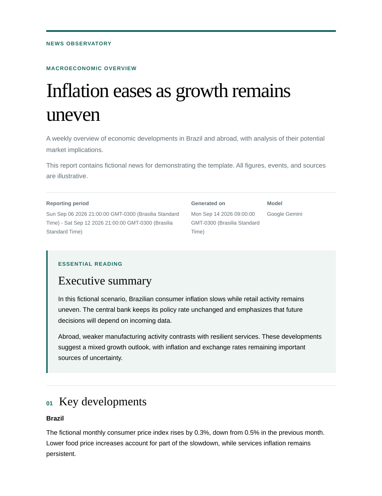
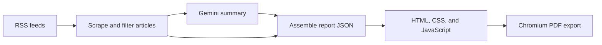

# AI News Summarizer

AI News Summarizer turns news from RSS feeds into a consolidated, readable PDF report. Its current focus is macroeconomic news, using Brazilian and US economic sources to produce reports in English. The project is intended to grow into a general news summarizer, covering more news types and topics beyond macroeconomics in the future.

The application collects article titles and descriptions, asks Google Gemini to summarize the supplied material, and combines the result with source references and report metadata. Each PDF includes an introduction, an executive summary, topic sections, and a source list.

## Sample report



First page of a PDF rendered with the project's HTML/CSS template and the bundled [fictional example data](src/pdf_generator/temp/example.json). This demonstrates the report layout; it is not a live news report or an example of the current prompt's exact editorial output.

## Setup

### Requirements

- Python 3.13 (the version used in the development environment).
- A Google Gemini API key and a model available to your account that supports the SDK's `client.interactions.create` call.
- Internet access to retrieve RSS feeds and call Gemini.
- Playwright's Chromium browser, installed separately from the Python package.

### 1. Create a virtual environment

Clone or download this repository, then open a terminal in its root directory:

```bash
python3 -m venv venv
source venv/bin/activate
```

On Windows, use:

```powershell
py -3.13 -m venv venv
.\venv\Scripts\Activate.ps1
```

### 2. Install dependencies

With the virtual environment activated:

```bash
python -m pip install -r venv_creation_components/requirements.txt
python -m playwright install chromium
```

If Chromium reports missing system libraries on Linux, install its system dependencies:

```bash
python -m playwright install-deps chromium
```

The system dependency installation may require administrator privileges.

### 3. Configure Gemini

Create a file named `.env` inside `src/`:

```dotenv
GEMINI_API_KEY=your_api_key_here
LLM_MODEL=your_supported_model_id_here
```

Replace both placeholders with your own values. The application loads these variables with `python-dotenv`; they can also be supplied through your environment. `src/.env` is excluded from Git.

### 4. Configure feeds and report settings

[src/feeds.jsonc](src/feeds.jsonc) contains the RSS feed URLs. The defaults cover IBGE news releases, BEA economic releases, and EIA's Today in Energy:

```json
{
  "feeds": [
    "https://agenciadenoticias.ibge.gov.br/agencia-rss",
    "https://apps.bea.gov/rss/rss.xml",
    "https://www.eia.gov/rss/todayinenergy.xml"
  ]
}
```

[src/settings.jsonc](src/settings.jsonc) controls the publication name, category, language metadata, and footer:

```json
{
  "document_presets": {
    "language": "en",
    "publication": "AI News Summarizer",
    "category": "Macroeconomic overview",
    "footer_text": ["AI may make mistakes - check the sources"]
  }
}
```

Despite their `.jsonc` extensions, both files are parsed as standard JSON: do not add comments or trailing commas.

The [Gemini prompt](src/prompts/gemini_prompt.md) defines the report's editorial scope, structure, and English output. Changing the language or category in the settings alone does not change those prompt instructions. Support for broader news categories is a future direction.

## Run

From the repository root, with the virtual environment activated:

```bash
python src/cli.py --output-path report.pdf
```

To include only articles published on or after a starting date:

```bash
python src/cli.py --output-path report.pdf --start-date 2026-09-01
```

Short options are also available:

```bash
python src/cli.py -o report.pdf -s 2026-09-01
```

| Option | Required | Description |
| --- | --- | --- |
| `-o`, `--output-path` | Yes | Destination PDF path, including the filename and `.pdf` extension. Relative paths are resolved from the working directory. |
| `-s`, `--start-date` | No | Inclusive starting date in `YYYY-MM-DD` format. Without it, all articles returned by the configured feeds are included. |
| `-h`, `--help` | No | Show command-line usage. |

RSS feeds generally expose only recent entries. The date filter narrows the downloaded entries; it does not retrieve historical articles that are no longer in the feeds.

Each run writes the assembled report to `src/pdf_generator/temp/news.json` and exports the PDF to the requested path. The intermediate JSON is overwritten on subsequent runs and excluded from Git. Run one report at a time because the renderer reads this shared file.

## Architecture



[src/cli.py](src/cli.py) orchestrates the pipeline:

1. **Collect news:** `rss_feed_scraper.py` uses Requests and Beautiful Soup to parse RSS items into a pandas DataFrame containing publication dates, titles, cleaned descriptions, and links. It applies the optional date filter. It summarizes feed descriptions rather than fetching full article pages.
2. **Generate a summary:** `llm.py` sends the article dates, titles, and descriptions to Gemini with the editorial prompt, then performs basic validation of the returned JSON.
3. **Assemble the report:** `json_generator.py` adds configured publication details, the date range of the selected articles, a generation timestamp, the model name, source references, and footer text.
4. **Render and export:** `pdf_generator/generator.py` starts a local HTTP server on an available port from `8000` through `8009`. The page loads `temp/news.json`, and `script.js` builds the report content. Playwright opens the page in Chromium, applies print media styling, exports the PDF, and stops the server after a successful export.

Report content is separate from presentation: the prompt controls generated text, the JSON carries content and metadata, and HTML/CSS/JavaScript control the layout. See [JSON_STRUCTURE.md](src/pdf_generator/JSON_STRUCTURE.md) for the report data format.

## Folder structure

```text
news/
├── README.md
├── docs/
│   └── images/
│       └── sample-report-first-page.png
├── src/
│   ├── cli.py                    # Command-line entry point
│   ├── rss_feed_scraper.py        # RSS collection and date filtering
│   ├── llm.py                     # Gemini inference and basic JSON validation
│   ├── json_generator.py          # Report metadata and JSON output
│   ├── feeds.jsonc                # RSS source configuration
│   ├── settings.jsonc             # Publication and document settings
│   ├── .env                      # Local credentials; ignored by Git
│   ├── prompts/
│   │   └── gemini_prompt.md       # Editorial and output instructions
│   └── pdf_generator/
│       ├── generator.py          # Local server and Playwright PDF export
│       ├── index.html            # Report template
│       ├── report.css            # Screen and print styles
│       ├── script.js             # JSON-to-DOM rendering
│       ├── JSON_STRUCTURE.md     # Report format documentation
│       └── temp/
│           ├── NEWS_JSON_FOLDER  # Empty placeholder file
│           ├── example.json      # Fictional report fixture
│           └── news.json         # Generated report; ignored by Git
├── venv_creation_components/
│   └── requirements.txt          # Pinned Python dependencies
└── venv/                         # Local virtual environment; ignored by Git
```

The `.env`, `venv/`, and generated `news.json` entries are created during setup or execution; they are not required to be present in a fresh clone.

## Current limitations

The project is under development. It currently targets RSS feeds with `item`, `pubDate`, `title`, `link`, and `description` fields; Atom feeds and missing-field handling are not implemented. JSON validation and error handling are basic, and repeated PDF export failures can keep the process retrying until interrupted with `Ctrl+C`.

Generated summaries can contain mistakes. Use the included source links to verify the report. The current prompt requests factual synthesis without financial recommendations.

## To do

- [ ] Broaden RSS feed compatibility.
- [ ] Improve error handling.
- [ ] Create a graphical user interface (GUI).
